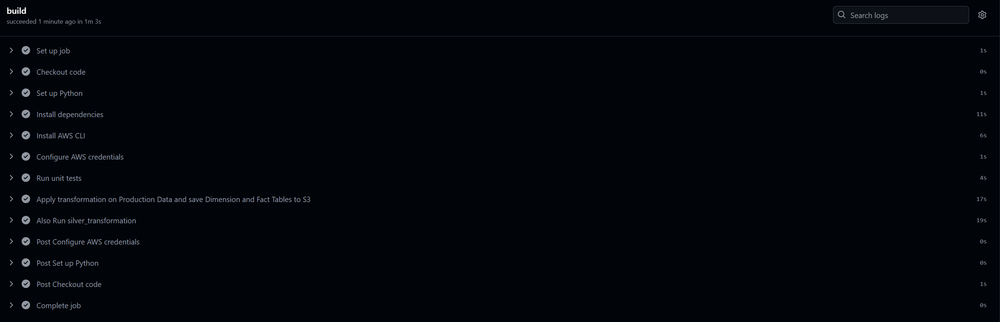
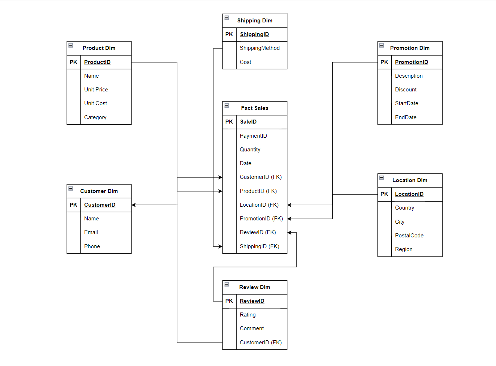

# **EmekaMarkt End-to-End Data Pipeline: From Raw Data to Business Insights**

## **Table of Contents**
1. Introduction
2. Project Overview
3. Tools and Technologies Used
4. Data Creation
5. Data Transformation
    - Unit Testing and GitHub Actions Integration
6. Data Model: Star Schema and Entity Relationship Diagram (ERD)
7. Data Visualization and Insights
8. Project Scalability: Using Databricks
9. Key Performance Indicators (KPIs)
10. Conclusion

---

## **1. Introduction**

This documentation outlines the design and implementation of an **end-to-end (E2E) data pipeline** for **EmekaMarkt**, a Germany-based e-commerce business. The project demonstrates capabilities in data engineering, data analysis, and cloud-based infrastructure management, following a step-by-step process from data generation to visualization.

---

## **2. Project Overview**

The **EmekaMarkt E2E Data Pipeline** showcases an integrated data engineering project that covers:
- **Data creation**: Simulated raw sales data generation using Python.
- **Data transformation**: Cleaning and structuring raw data using Python and querying with AWS Athena.
- **Automated testing**: Using `unittest` in Python to validate transformation logic.
- **Cloud storage and querying**: Using AWS S3 and Athena for scalable storage and querying.
- **Business insights**: Created interactive dashboards using AWS QuickSight.

This pipeline demonstrates a real-world scenario where business performance is analyzed using cloud-native tools.

---

## **3. Tools and Technologies Used**

The following tools and technologies were used throughout this project:

- **AWS S3**: Storing both raw and transformed data.
- **AWS Athena**: Querying data stored in S3 using SQL.
- **AWS QuickSight**: Building interactive dashboards for business insights.
- **Python**: For data transformation and processing.
- **Unittest (Python)**: For automated testing to ensure the accuracy of data transformations.
- **GitHub Actions**: Used for setting up CI/CD to run automated tests and deploy the transformations.

---

## **4. Data Creation**

The data creation process involved generating synthetic e-commerce sales data for **EmekaMarkt** using a Python script i wrote. The script produced various dimensions of data such as:

- **Customer**: Information about customer details.
- **Product**: Product attributes such as category and price.
- **Location**: Geographical information related to sales.
- **Promotion**: Discounts and promotions applied to the products.
- **Shipping**: Shipping methods and costs.
- **Review**: Customer reviews and ratings.
- **Sales (fact table)**: Transaction-level data.

The generated raw data was stored in the S3 bucket `emeka-market-raw-sales-data` for further transformation.

**Script Reference**: [sales_raw_sales_data_creation.py](./jobs/tasks/sales_raw_data_creation/sales_raw_data_creation.py)

---

## **5. Data Transformation**

Once the raw data was created, it was transformed into a structured, queryable format using **Python (pandas)** for transformation and **SQL queries in Athena** for data access. The transformation converted the raw data into the following tables:

- **Fact Table**: `fact_sales` containing transaction data.
- **Dimension Tables**: `product_dim`, `customer_dim`, `location_dim`, `promotion_dim`, `shipping_dim`, and `review_dim`.

### **Transformation Process Overview**:
1. Clean and transform the raw sales data using Python.
2. Organize the data into a **star schema** format for efficient querying.
3. Store the final, transformed tables in the S3 bucket `emeka-transformed-sales-data`.

**Transformation Script**: [silver_transformation.py](./jobs/tasks/raw_data_transformation/silver_transformed_all.py)

### **Unit Testing and GitHub Actions Integration**

To ensure the accuracy of the data transformation, the transformation script was tested using Python’s built-in **unittest** framework. The testing process verified that the transformations met the expected business rules.

The CI/CD pipeline, managed through **GitHub Actions**, was set up to:
1. **For the purpose of this project, Automatically trigger** a run whenever there is a `push` or `pull` Git command.
2. Run unit tests automatically to ensure the tests pass before executing the transformation script.
3. Deploy the transformation script only if all tests pass.

This automation ensures that no incorrect data enters production.

**Unit Test Script**: [transformation_unit_test.py](./unit_test/scr/transformation_unit_test.py)

**GitHub Actions Workflow**: .

---

## **6. Data Model: Star Schema and ERD**

The data follows a **star schema** design, which organizes the transformed data into a central **fact table** and several related **dimension tables**.

### **Fact Table**:
- **`fact_sales`**: Contains key metric like `Quantity` and foreign keys linking to dimension tables.

### **Dimension Tables**:
- **Product Dimension (`product_dim`)**: Contains product details such as product name, category, and price.
- **Customer Dimension (`customer_dim`)**: Stores customer details, including loyalty status and contact information.
- **Location Dimension (`location_dim`)**: Captures geographic data related to transactions.
- **Promotion Dimension (`promotion_dim`)**: Information on discounts applied to sales.
- **Shipping Dimension (`shipping_dim`)**: Shipping methods and associated costs.
- **Review Dimension (`review_dim`)**: Customer feedback on products.

**Entity Relationship Diagram (ERD)**: 

---

## **7. Data Visualization and Insights**

**AWS QuickSight** was used to create two interactive dashboards.   I can also produce similar dynamic dashboards using **Tableau**, **Power BI**, and **Looker**.: 
1. **Sales Overview Dashboard** (Source): Provides a high-level overview of total sales, profit margins, and other key metrics.
2. **Product Insights Dashboard** (Target): Offers a detailed breakdown of product performance, allowing drill-through navigation from the Sales Overview Dashboard.

### **Sales Overview Dashboard**:
The **Sales Overview Dashboard** provided an overall view of the store’s performance. It summarized total revenue, profit margins, and the performance of different product categories over time. The dashboard also showed how shipping methods affected order volumes, providing insights into customer preferences regarding shipping options.

**PDF Export**: [Sales Overview Dashboard](./visualizations/Sales_Overview_Dashboard.pdf)

### **Product Insights Dashboard**:
The **Product Insights Dashboard** focused on product-level performance, providing detailed metrics such as total cost, revenue generated, and profit margins for specific products. This dashboard allowed users to drill down into specific products to analyze their sales by region and customer reviews, offering a comprehensive view of individual product success.

**PDF Export**: [Product Insights Dashboard](./visualizations/Product_Insights_Dashboard.pdf)

These dashboards provided clear insights into the business’s overall performance and individual product success, helping to guide decision-making.

---

## **8. Project Scalability: Using Databricks**

Although **AWS S3** and **Athena** were used for this project, I have experience using **Databricks** in professional settings, which could scale this pipeline for larger datasets. Databricks offers advanced processing capabilities, and combined with **AWS Glue**, it can automate ETL workflows seamlessly.

---

## **9. Key Performance Indicators (KPIs)**

The following KPIs were defined and visualized in the dashboards:

1. **Total Revenue**: Total sales generated from the store.
2. **Profit Margin**: Difference between revenue and total costs (including shipping).
3. **Customer Loyalty**: Measured by customer loyalty status (e.g., Bronze, Silver, Gold).
4. **Product Performance**: Revenue and profit per product category and individual product.
5. **Shipping Efficiency**: Number of orders by shipping methods and the costs associated with them.

---

## **10. Conclusion**

The **EmekaMarkt E2E Data Pipeline** demonstrates my ability to manage an entire data pipeline, from generating raw data to delivering business insights through interactive dashboards. Key highlights of the project include:

- **Data Engineering**: Efficient transformation of raw data into structured formats.
- **Data Analysis**: Defining and visualizing KPIs that help monitor business performance.
- **Cloud Technologies**: Leveraging AWS services like S3, Athena, and QuickSight to create a scalable, cloud-native solution.

---
